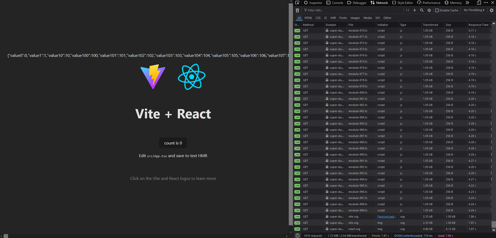
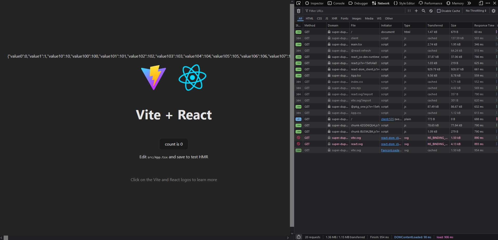

# test-vite-monorepo-1k-files

This repository demonstrates how to optimize the case where you are using Vite monorepo and there are many files that you load during the cold start. This can be a huge issue when you run your application, especially if you are running in a monorepo with a lot of packages.

We can utilize the [dependency optimization options](https://vite.dev/config/dep-optimization-options), in this case `optimizeDeps.include` to "pre-bundle" packages from the repository. In this case, I have an alias package called `@pkg/one`. By setting this configuration:

```ts
{
  // ...
  optimizeDeps: {
    force: process.env.FORCE_PREBUNDLE === "true",
    include: ["@pkg/one"],
  }
}
```

We can achieve a better developer experience. However, do make sure that the dependency that you prebundle are _not_ the one that you will be updating often. For example, files that are autogenerated are probably one of the good examples that they should be prebundled. Hence why in this PR, I gave example of loading 1000 files, which hurts developer performance on cold starts.

## Before

Before pre-bundling: we have 1000+ requests and almost 8s to load the entire thing.



## After

After pre-bundling: we have only ~20 requests and only under 1 second to load the entire thing.


